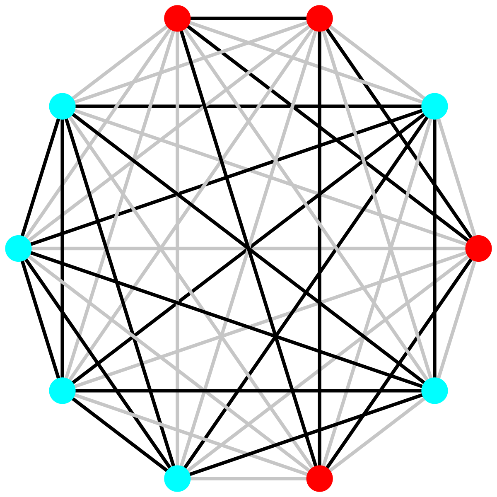

In their influential [1997 Quarterly Journal of Economics study](https://www.jstor.org/stable/pdf/2951270), Easterly and Levine describe the Ethno-Linguistic Fractionalization (ELF) index as "a measure of ethnolinguistic diversity ... that measures the probability that two randomly selected individuals in a country belong to different ethnolinguistic group." A complement of the [Herfindahl-Hirschman Index (HHI) of concentration](https://en.wikipedia.org/wiki/Herfindahl%E2%80%93Hirschman_index), the ELF is one of the most widely used metrics in the social sciences, employed in foundational studies of [civil war](https://www.cambridge.org/core/journals/american-political-science-review/article/abs/ethnicity-insurgency-and-civil-war/B1D5D0E7C782483C5D7E102A61AD6605#article), [development](https://www.jstor.org/stable/2951270), [growth](https://doi.org/10.2307/2946696), and [party systems](https://doi.org/10.1177/0010414005278420). In political science, [Laakso and Taagepera's](https://doi.org/10.1177/001041407901200101) effective number of parties (ENP) measure, the inverse of the HHI, is similarly important. Despite its clear micro-foundations, social scientists are using the ELF and related indices as *aggregate* measurements at the national, sub-national, or local level.

[In a recently published study](https://doi.org/10.1017/S0003055426101579) in the *American Political Science Review*, [Carl Müller-Crepon](https://www.carlmueller-crepon.org/) and I show that the ELF, the ENP, and other indices, such as the GINI, can be estimated at the micro-level. We rely on a widely-used data source in the social sciences: nationally representative probability samples. Rather than analyzing individual-level survey data directly, we pair respondents into dyads and assess their likeness on variables such as ethnicity or (intended) vote choice. This gives us a nationally representative sample of pairs of randomly selected individuals with shared or different values on a range of variables like ethnicity or voting. The sample mean of these estimates approaches the country-level index of interest.[^1]

[^1]: Since we measure coethnicity rather than ethnic difference for each individual pair, we need to take the complement of our sample mean to obtain the ELF.

Our pairwise, survey-based approach to index measurement offers several advantages. First, the ELF estimated on respondent-pair data comes with uncertainty estimates that an index calculated with aggregate-level population share data lacks. Second, estimating the ELF on respondent pairs from surveys dramatically increases statistical power in subsequent analyses. Third, a pairwise approach enables the simultaneous analysis of micro, meso, and macro patterns. Fourth, estimating the ELF at the respondent-pair-level opens up broad comparisons across different contexts without sacrificing individual-level insights.

To realize these advantages, we derive the new *covoting regression* (CVR) model. The CVR is a simple linear probability model estimated on pairs of survey-respondents (see Figure). By focusing on covoting and coethnicity rather than individual voting intentions and ethno-linguistic identity, we abstract away from country-specific idiosyncrasies. This abstraction allows us to compare the effect of cleavages like ethnicity on voting intentions over time or across countries, even if voters face different parties in different elections or the range of relevant identity categories varies.

{width=60% fig-align="center"}

Furthermore, the CVR addresses two methodological challenges that limit existing approaches to studying the relationship between ethnicity and voting intentions. First, existing micro-level studies that build on survey data suffer from potential selection bias because voters' choices are frequently limited. For example, voters might be faced with a [menu that consists exclusively of (non-)coethnic](https://doi.org/10.1086/720304) candidates. Existing studies that define ethnic voting as the correspondence of voter and candidate identity will over(under)-estimate ethnic voting. By focusing on coethnicity and shared voting intentions, the CVR captures bloc-voting pattern, where most members of one group support the same candidate or party.[^2] Second, the CVR avoids potential ecological fallacies and omitted variable bias that potentially arise in aggregate [group](https://doi.org/10.1111/j.1540-5907.2012.00601.x) or [country-level analyses](https://doi.org/10.1177/0010414005278420). This problem threatens to become acute in cases where cross-cleavage covoting is wide-spread.

[^2]: The CVR will still be biased if such restricted choice menus result from strategic party entry or exit, but its bias is smaller than that of alternative models.

In our study, we apply the CVR to studying voting intentions in 28 sub-Saharan Africa countries using five waves of [Afrobarometer surveys](https://www.afrobarometer.org/). Our approach allows us to comparatively revisit multiple questions that scholars previously asked in single-case studies. We investigate the relative importance of coethnicity in voting intentions as compared to other cleavages, if and how the effect of coethnicity changes over time in different contexts, and the mechanisms by which coethnicity affects vote choice. Our findings shed light on each of these questions:

1. In sub-Saharan Africa, coethnicity is associated with a 17 percentage point increase in the probability of covoting on average, an estimate four times larger than that of other cleavages, such as religion, education, urban-rural differences, and income. This dominance of coethnicity in covoting intentions highlights that prominent case studies, which question the relevance of ethnicity in vote choices, describe exceptions rather than broader trends (e.g., [here](https://doi.org/10.1017/S0003055409990311), [here](https://doi.org/10.1080/13510341003700394), and [here](https://www.cambridge.org/core/books/inequality-and-political-cleavage-in-africa/F224A9681A591EDF6C4FA11199B5A972)).

2. Coethnic covoting has remained stable over time. While it varies strongly within countries, the overall estimate for each of the five survey waves between 2005 and 2018 is effectively flat.

3. When analyzing mechanisms, we find that meso-level group and party-based explanations rather than country-level institutions or individual-level characteristics offer the best explanation for the high correlation between coethnicity and covoting. Belonging to the same politically relevant or socially constructed ethnic identity, even if respondents' mother tongues differ, accounts for about half of the overall effect of coethnic covoting.
