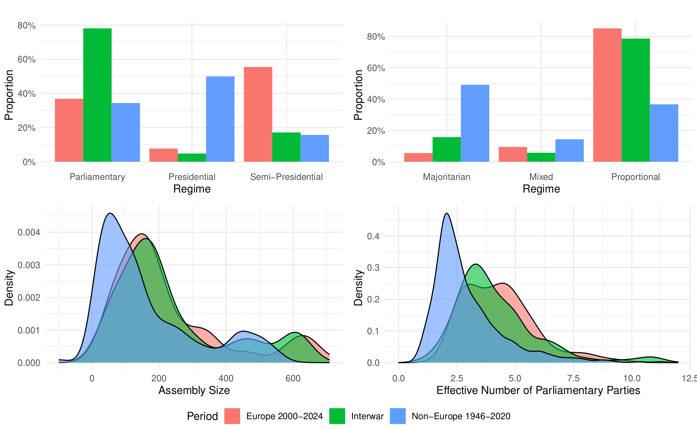
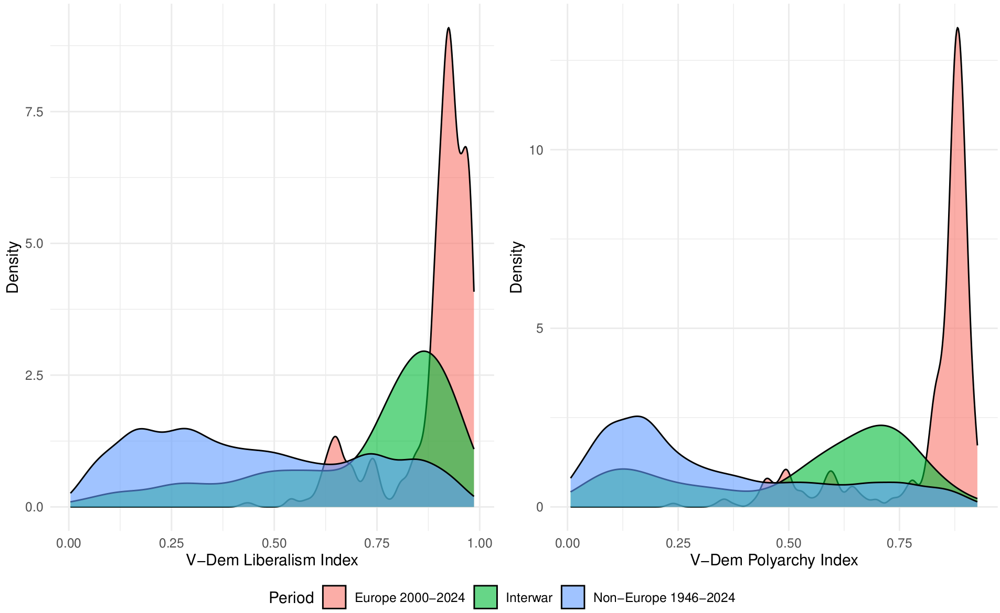
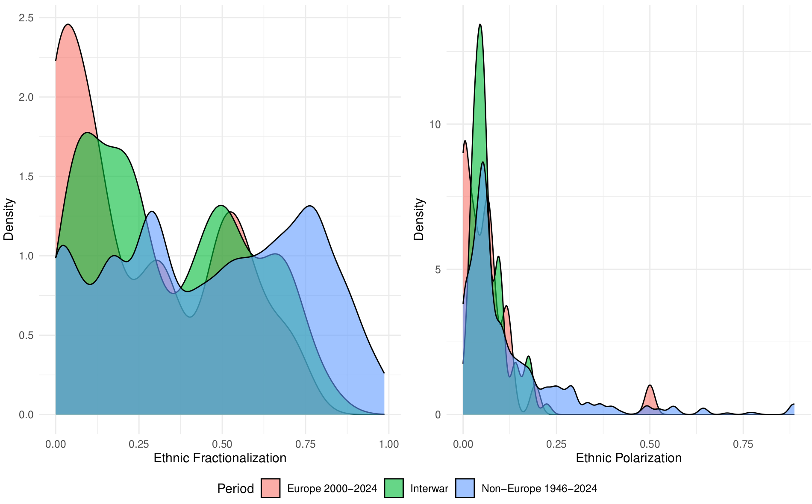
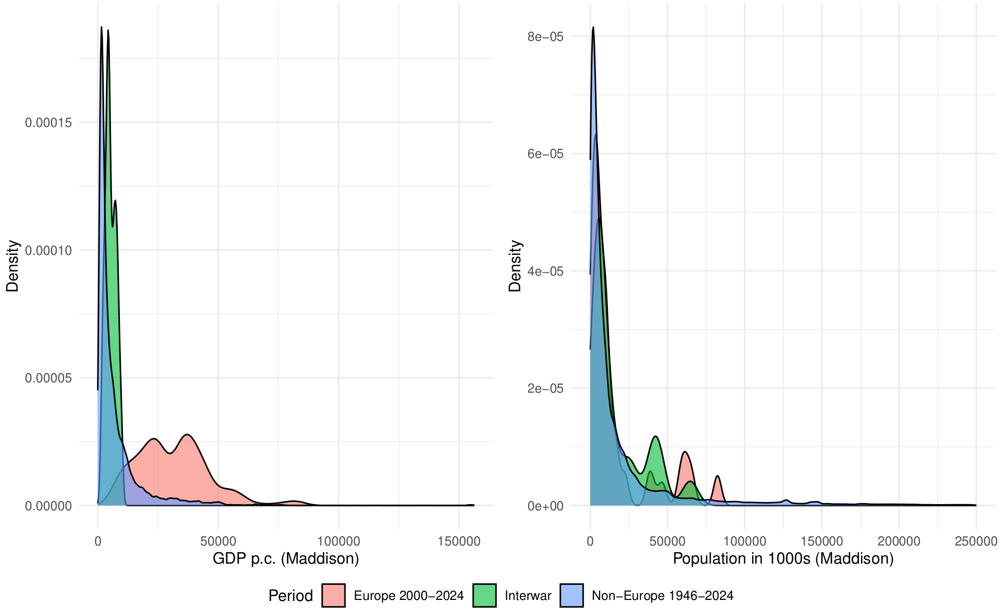

In the past few years, my research focus has shifted towards [Europe's interwar period](https://www.erc-danger.de). My main goal was to study democratic breakdown comparatively in the past, and then apply the insights I gained to what might happen in Europe today. I did so because **I was skeptical that we could know much about the risk of democratic backsliding into breakdown** in what we thought were consolidated democracies **without observing democratic failure** in Europe or North America today.[^1]

When I tried to publish my work on interwar Europe, multiple reviewers asked me about the utility of insights from history for contemporary politics.[^2] For example, one R2 observed:

> "Hence, as a reader, **I find it difficult to say why the authors used this data and did not focus on more recent data** (which surely is readily available for the analyses that the authors run). What is the added benefit of relying on data from the interwar period? ... Also, I would like to see the authors reflect more on the extent to which their analysis can provide insights for contemporary democracies, **since democratic institutions** and the ways in which polarization manifests **have changed so much since the interwar period.**"

Despite the increasing prominence of history in political science, other R2s voiced similar skepticism: (1) Why would I not use more recent data? And (2) what could we possibly learn from presumably very distant historical cases? 

Initially, observing the rapidly-growing [Historical Political Economy](https://www.broadstreet.blog/) (HPE) subfield makes the doubts on the utility of history appear surprising. In their [review](https://www.annualreviews.org/content/journals/10.1146/annurev-polisci-051921-102440), [Volha Charnysh](https://sites.mit.edu/charnysh/), [Eugene Finkel](https://sais.jhu.edu/directory/eugene-finkel), and [Scott Gehlbach](https://scottgehlbach.net) explain why HPE scholars study historical cases: to understand the past, to understand the present via [historical legacies](https://www.broadstreet.blog/p/legacies-of-repression-how-europes), or to [explore theory](https://www.broadstreet.blog/p/a-bit-more-about-theory-in-historical-political-economy).

Yet I did not frame my work for the HPE literature but at [comparativists](https://doi.org/10.1080/13510347.2025.2537218) and [conflict researchers](https://doi.org/10.1177/00223433251347763), who often work with relatively recent or fully contemporary data. Thus, I might be accused of bringing R2’s reaction on myself. I chose the historical comparative approach in part, because I wanted to investigate the question of democratic breakdown that frequently escapes the single-case/causal identification approach preferred by HPE scholars, and increasingly comparativists, as [Tom Pepinsky](https://www.tompepinsky.com) [points out](https://www.annualreviews.org/content/journals/10.1146/annurev-polisci-051017-113314): 

> "what is lost, in addition to aggregate country-level phenomena such as democracy or inequality, is attention to political systems, actors, policy processes, social movements, and other macropolitical phenomena that matter for understanding politics in individual countries."

Moreover, I side-stepped the HPE literature, because I did not want to understand the present via historical legacies. Instead, my goal was to **to understand whether contemporary (European) democracies are at risk of democratic failure, by looking at the best comparison cases, which I argued are their historical counterparts.** I was convinced that historical European democracies were better matches to contemporary cases than democracies that failed in many postwar countries in Asia, Latin America, or sub-Saharan Africa that [studies](https://www.cambridge.org/core/journals/perspectives-on-politics/article/democratic-decline-in-the-united-states-what-can-we-learn-from-middleincome-backsliding/1D9804407AAD81287AA0CA620BABDEA6) of [democratic backsliding](https://www.journalofdemocracy.org/articles/on-democratic-backsliding/) frequently rely upon.[^3]

This goal brought me back to reading work on [external validity](https://www.annualreviews.org/content/journals/10.1146/annurev-polisci-041719-102556), which I was not aware of when making my argument for learning from history. I now learned that I should have established *transportability* to justify my goal of extrapolation. Transportability is a sub-type of external validity that "refers to inferences based on a sample but targeted at a different population."[^4]  To establish transportability, Findley et al. suggest a list of evaluative criteria that include **M**echanisms, **S**ettings, **T**reatments, **O**utcomes, **U**nits, and **T**ime (M-STOUT). 

Despite not knowing Findley et al.'s review at the time, my coauthors and I tried to demonstrate the similarities of the settings, units, and major explanatory variables between interwar and contemporary Europe to justify that our proposed theoretical mechanisms from the past might similarly operate in the present. Hidden in some [appendices](https://www.tandfonline.com/doi/full/10.1080/13510347.2025.2537218#supplemental-material-section), we compared European democracies in the 2000–2024 period to European interwar democracies, and the population of global post-World War II countries. Across institutional and social structure variables, interwar European democracies (green) resemble today's European democracies (blue) as much or more than postwar cases from around the globe (red).

While my appendix responses to R2's second point that, in fact, not as much had changed since the interwar period as R2 assumed, eventually satisfied two editors, there are of course other dimensions that matter for understanding democratic stability. Postwar countries around the world might for example be closer to contemporary Europe in terms of technological progress, or both historical European cases and non-European postwar countries might be equidistant to contemporary cases as they are when comparing levels of economic development (Figure 4).[^5] Similarly, I have no data on political culture, which might have changed dramatically since the 1920s and 1930s.

According to [Findley et al](https://www.annualreviews.org/content/journals/10.1146/annurev-polisci-041719-102556), the solution to extrapolating from a sample to a different population that differ on some dimensions is to weight variables from the sample to match the target population when drawing conclusions for the latter. This is far easier when situating field experiments or survey samples than when investigating cross-national outcomes like democratic breakdown. For example, contemporary GDP per capita levels are historically unprecedented, and cannot be matched to historical cases. However, this limitation similarly affects any comparisons to backsliding/breakdown cases outside of Europe, the Anglo-Saxon settler colonies, and Japan. 

I have no ideal solution to offer that satisfies internal and external validity and allows me to study breakdown as cleanly as possible. In the whole debate I wish that authors and reviewers, whether they engage in causal identification in single-case studies, large-N observational studies, or small to medium-N comparisons would heed John Huber's more than a [decade-old admonition](https://goodauthority.org/news/is-theory-getting-lost-in-the-identification-revolution/) published when single case studies first became very prominent.  

> "Many of the best strategies in causal identification essentially amount to case studies … It is the focus on the specific case that typically allows for convincing causal identification, and when done well, we can know with near certainty whether in the specific case, variable x has had a causal effect on variable y. **The problem, however, lies in situating the case, which is crucial if we are to draw useful inferences about causation.**"

[^1]: I still lack the conviction to determine whether particular OECD democracies have failed or not, even as prominent political scientists confidently classify the United States as a [competitive authoritarian regime](https://ash.harvard.edu/wp-content/uploads/2025/03/Levitsky-Way-2025-The-Path-to-American-Authoritarianism-What-Comes-After-Democratic-Breakdown-3.pdf).

[^2]: By history I mean, somewhat arbitrarily, the time period before 1946. Many political science datasets start only then, or later.

[^3]: These were my main responses to R2's two points why I did not use more recent data, and what we can learn from history. Importantly, close resemblance between two samples/cases is unhelpful when trying to establish how far a theoretical argument travels. For that purpose, researchers should maximize the diversity of their cases, as [Egami and Da In Lee](https://onlinelibrary.wiley.com/doi/10.1111/ajps.70070) argue in their paper on multi-site experimental studies. Mixed methods researchers, like Jason Seawright in his book [*Multi-Method Social Science*](https://www.cambridge.org/core/books/multimethod-social-science/286C2742878FBCC6225E2F10D6095A0C), made this point before. [Sona Golder](https://sonagolder.com), [Jinhyuk Jang](https://jinhyukjang.com), and I take that approach in a forthcoming paper on [portfolio allocation in non-presidential democracies](https://ncbormann.github.io/papers/BormannGolderJang-Global_Portfolio_Allocation-Aug2026.pdf). 

[^4]: The other sub-type of external validity is generalizability, which "refers to inferences based on a sample drawn from a defined population."

[^5]: This is probably the most reassuring outcome when worrying about [democratic survival](https://journals.sagepub.com/doi/abs/10.1177/00104140231168363) given the very strong correlation between breakdown and [economic development](https://books.google.de/books?id=uiFH5dh12p0C&printsec=frontcover&redir_esc=y#v=onepage&q&f=false).
