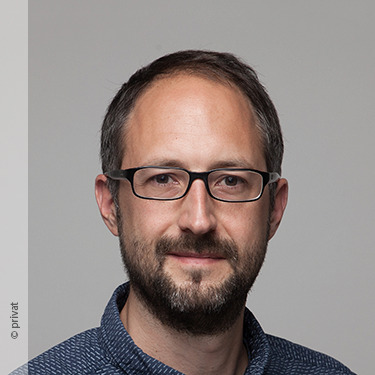
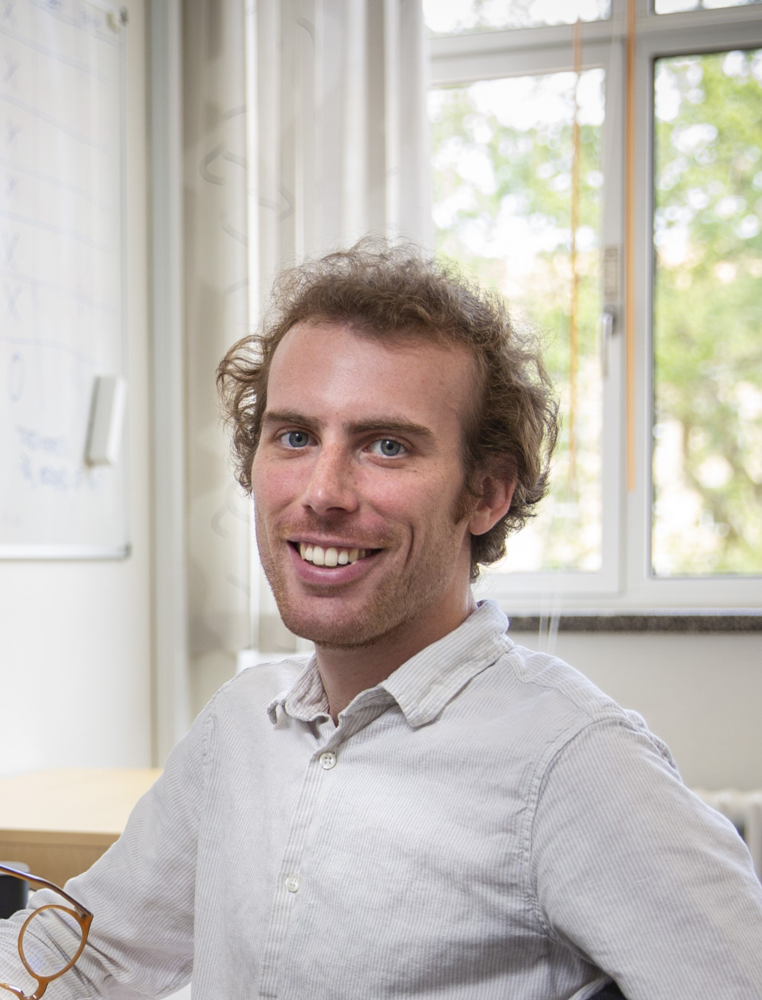
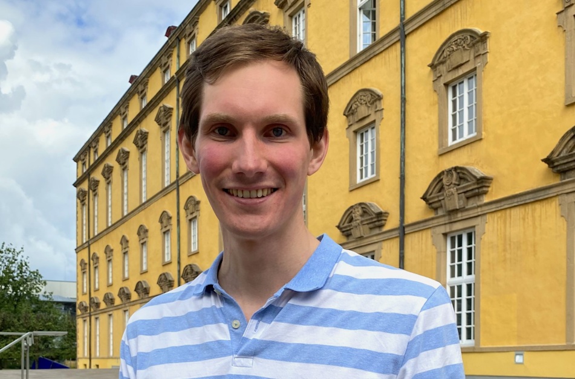
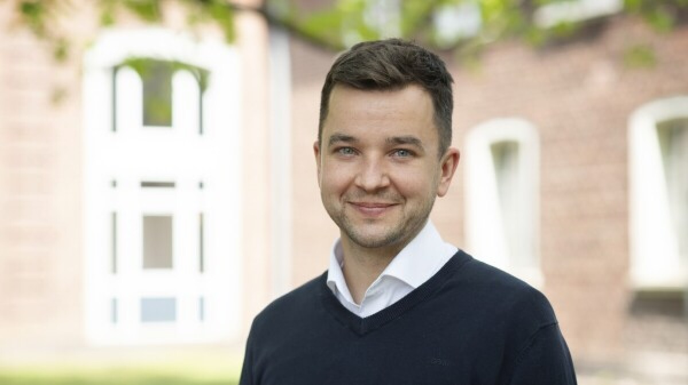
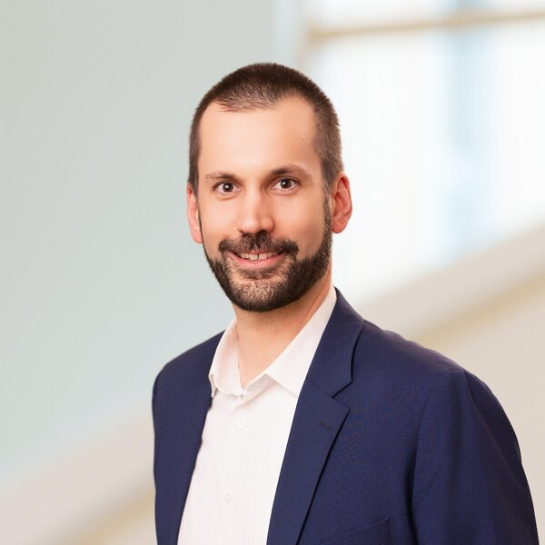
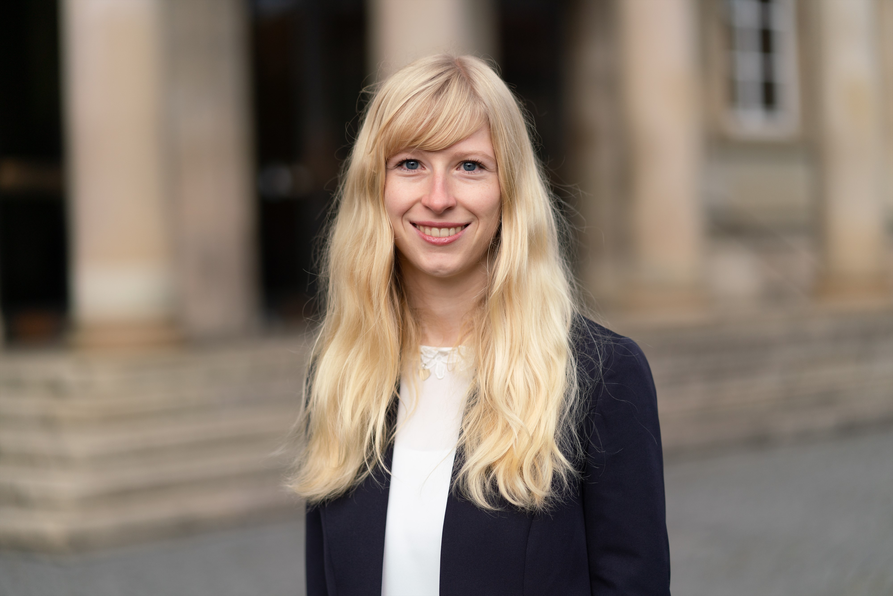

Founded in 2022, the **Conflict Research Exchange Workshop (CREW)** brings together political scientists from the University of Osnabrück, the University of Duisburg-Essen, and Witten/Herdecke University to discuss ongoing research and new ideas. It aims to give regular feedback to its participants, in particular to emerging scholars at the PhD and post-doctoral levels in the fields of conflict research and contentious politics. Online workshops take place monthly. Once a year, we organize a joint retreat.

## Members {.section-heading}

::: {.crow-grid}

::: {.crow-card}

{.crow-photo fig-alt="Alexander De Juan"}

::: {.crow-name}
Alexander De Juan
:::

::: {.crow-affil}
Professor of Comparative Politics, University of Osnabrück
:::

::: {.crow-bio}
Alexander De Juan's research focuses on political attitudes and behavior in the context of conflict and autocratic rule with a particular interest in historical episodes of contention.
:::

:::

::: {.crow-card}

{.crow-photo fig-alt="Edoardo A Vigano"}

::: {.crow-name}
Edoardo A Viganò
:::

::: {.crow-affil}
Visiting Professor in Quantitative Methods, University Carlos III., Madrid 
:::

::: {.crow-bio}
Edoardo A Viganò studies political institutions, representation, and political violence.
:::

:::

::: {.crow-card}

{.crow-photo fig-alt="Finn Klebe"}

::: {.crow-name}
Finn Klebe
:::

::: {.crow-affil}
Post-Doc, University of Osnabrück
:::

::: {.crow-bio}
Finn Klebe’s research examines contentious politics, repression, and civil war dynamics, focusing on organizational relations and their impact on conflict escalation, democratization, and post-conflict political attitudes. 
:::

:::

::: {.crow-card}

{.crow-photo fig-alt="Johannes Vüllers"}

::: {.crow-name}
Johannes Vüllers
:::

::: {.crow-affil}
Professor of International Relations, University of Duisburg-Essen
:::

::: {.crow-bio}
Johannes Vüllers studies contentious politics, civil wars, and conflict resolution with a regional expertise on Southeast Asia.
:::

:::

::: {.crow-card}

{.crow-photo fig-alt="Nils-Christian Bormann"}

::: {.crow-name}
Nils-Christian Bormann
:::

::: {.crow-affil}
Professor of International Political Studies, Witten/Herdecke University
:::

::: {.crow-bio}
Nils-Christian Bormann investigates the causes and consequences of political violence, power-sharing coalitions, and group-based inequality.
:::

:::

::: {.crow-card}

{.crow-photo fig-alt="Olga Jerjomina"}

::: {.crow-name}
Olga Jerjomina
:::

::: {.crow-affil}
PhD Student, Witten/Herdecke University
:::

::: {.crow-bio}
Olga Jerjomina studies ethnic identities and political behaviour, examining how group-based divisions structure political attitudes, voting patterns, and susceptibility to external political influence.
:::

:::

::: {.crow-card}

{.crow-photo fig-alt="Teresa Hummler"}

::: {.crow-name}
Teresa Hummler
:::

::: {.crow-affil}
Post-Doc, University of Duisburg Essen
:::

::: {.crow-bio}
Teresa Hummler is studying the influence of contentious politics on organizational development and individual political attitudes. In her PhD thesis, she investigated how neighborhood characteristics shape individuals’ political support. 
:::

:::

:::
