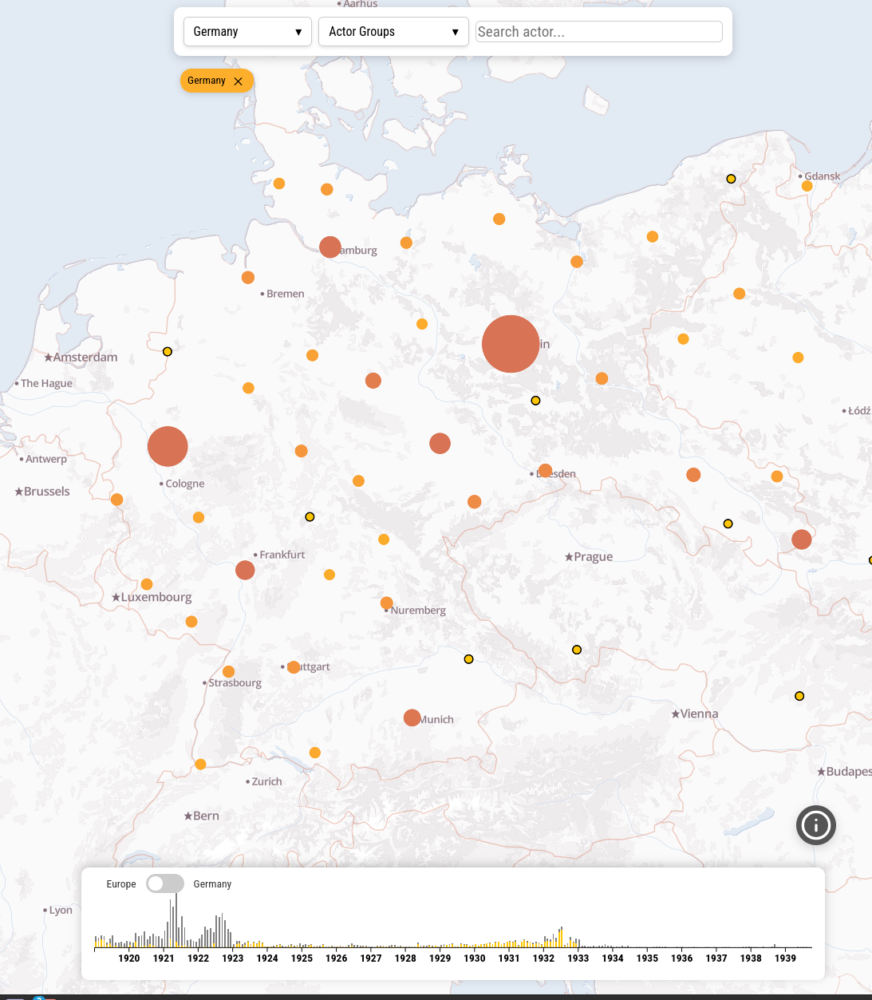
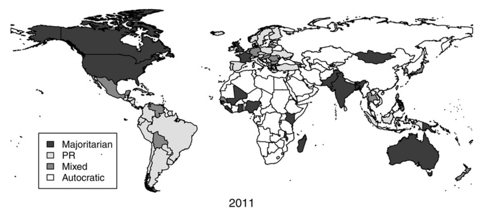
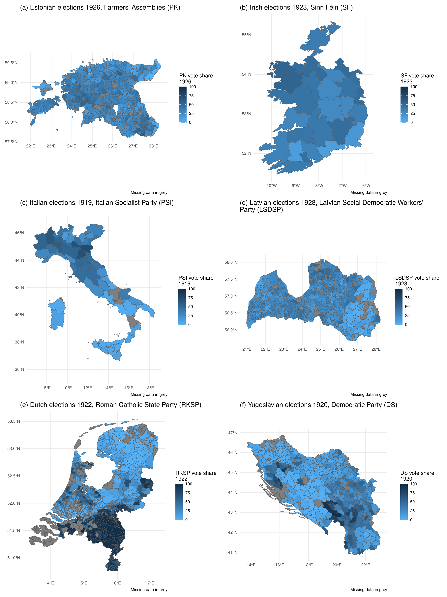
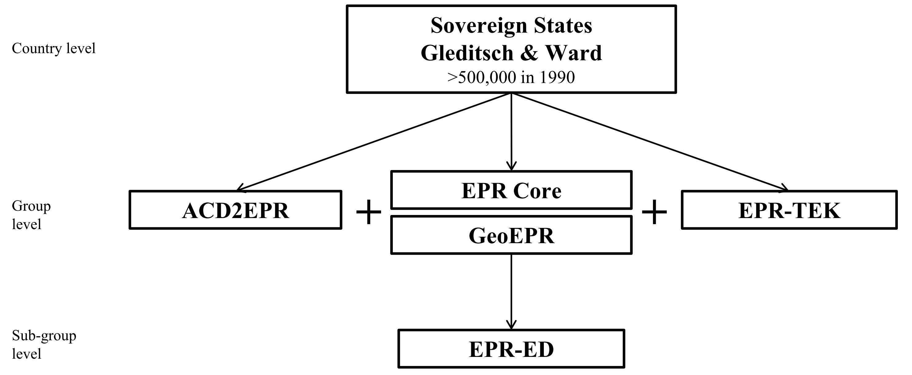
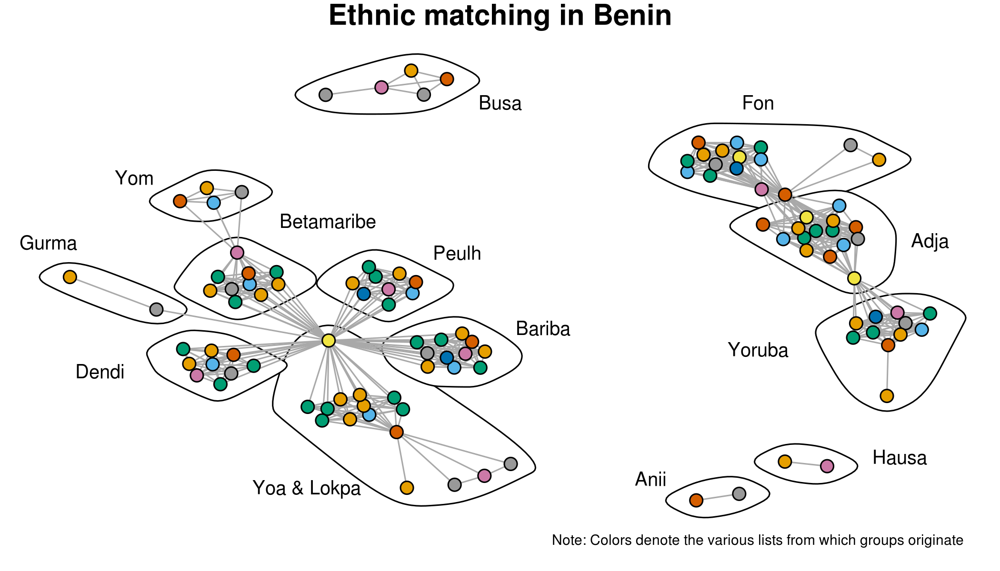

::: {.data-grid}

::: {.data-card}

{.data-card-img fig-alt="CAIN Data"}

::: {.data-card-body}

::: {.data-card-title}
Citizen Anger Interwar News (CAIN) Data
:::

::: {.data-card-desc}
The Citizen Anger Interwar News (CAIN) Data covers political violence events reports from ten European interwar democracies. It records their location, timing, the number of casualties, and actors involved. The interactive map allows you to explore the data.
:::

::: {.data-card-links}
[Dataset](https://dataverse.harvard.edu/dataset.xhtml?persistentId=doi:10.7910/DVN/TZAGJD){.pub-link target="_blank"}
[Interactive Map](https://ncbormann.github.io/cain-map-app/){.pub-link target="_blank"}
:::

:::

:::

::: {.data-card}

{.data-card-img fig-alt="Democratic Electoral Systems"}

::: {.data-card-body}

::: {.data-card-title}
Democratic Electoral Systems
:::

::: {.data-card-desc}
Information on electoral rules in 1,826 legislative elections and 648 presidential elections in democracies since 1919. The dataset spans two time periods covered in separate data publications: the interwar period (1919–1945) and the postwar period (1946–2020).
:::

::: {.data-card-links}
[Interwar Data (1919–1945)](https://doi.org/10.7910/DVN/FWLXHM){.pub-link target="_blank"}
[Postwar Data (1946–2020)](https://mattgolder.com/elections){.pub-link target="_blank"}
:::

:::

:::

::: {.data-card}

{.data-card-img fig-alt="AIEEDA"}

::: {.data-card-body}

::: {.data-card-title}
Archive of Interwar Europe Election Data & Assemblies (AIEEDA)
:::

::: {.data-card-desc}
A multi-level dataset of parliamentary elections in interwar Europe (1919–1939), covering 137 elections across 25 democracies. Includes electoral results, ideological and organizational data for 401 parties and 35 alliances, and cabinet data.
:::

::: {.data-card-links}
[Dataset](https://osf.io/qs3dg/files/osfstorage){.pub-link target="_blank"}
[Paper](https://doi.org/10.1038/s41597-025-04969-y){.pub-link target="_blank"}
:::

:::

:::

::: {.data-card}

{.data-card-img fig-alt="Ethnic Power Relations"}

::: {.data-card-body}

::: {.data-card-title}
Ethnic Power Relations (EPR)
:::

::: {.data-card-desc}
Data on ethnic groups' access to state power, their settlement patterns, links to rebel organizations, and transborder ethnic kin. The EPR dataset family is maintained by the International Conflict Research group at ETH Zürich.
:::

::: {.data-card-links}
[Dataset](https://icr.ethz.ch/data/epr/){.pub-link target="_blank"}
:::

:::

:::

::: {.data-card}

{.data-card-img fig-alt="LEDA"}

::: {.data-card-body}

::: {.data-card-title}
Linking Ethnic Data from Africa (LEDA)
:::

::: {.data-card-desc}
A systematic approach to linking over 8,100 ethnic categories from 11 databases on ethnic groups in Africa. Includes the LEDA open-source software package to help researchers merge ethnic data across datasets.
:::

::: {.data-card-links}
[Paper](https://doi.org/10.1177/00223433211016528){.pub-link target="_blank"}
[PDF](papers/leda_maintext.pdf){.pub-link target="_blank"}
:::

:::

:::

:::
