

Working Papers

::: {.pub-card}
::: {.pub-title}
Is there a Prime Ministerial Party Advantage in Portfolio Allocation? How the Cases You Choose Affect the Answers You Get
:::
::: {.pub-authors}
Nils-Christian Bormann, Sona N. Golder & Jinhyuk Jang
:::
::: {.pub-venue}
Working Paper, 2025
:::
::: {.pub-links}
[PDF](papers/BormannGolderJang-Global_Portfolio_Allocation-Nov2025.pdf){.pub-link target="_blank"}
:::
:::

::: {.pub-card}
::: {.pub-title}
Conflict Risk between the Russian Federation and any EU State: An Expert Survey
:::
::: {.pub-authors}
Nils-Christian Bormann
:::
::: {.pub-venue}
Working Paper, 2025
:::
::: {.pub-links}
[PDF](papers/Bormann-expertsurvey_report-251003.pdf){.pub-link target="_blank"}
:::
:::

::: {.pub-card}
::: {.pub-title}
Getting Religion Wrong: A Response to Toft's 'Getting Religion Right'
:::
::: {.pub-authors}
Nils-Christian Bormann, Lars-Erik Cederman & Manuel Vogt
:::
::: {.pub-venue}
Working Paper, 2024
:::
::: {.pub-links}
[PDF](papers/BormannCedermanVogt-Getting_Religion_Wrong-Main-JCR-Aug2024-complete.pdf){.pub-link target="_blank"}
:::
:::

---

Publications

2026

::: {.pub-card .pub-card-with-img}
::: {.pub-card-thumb}
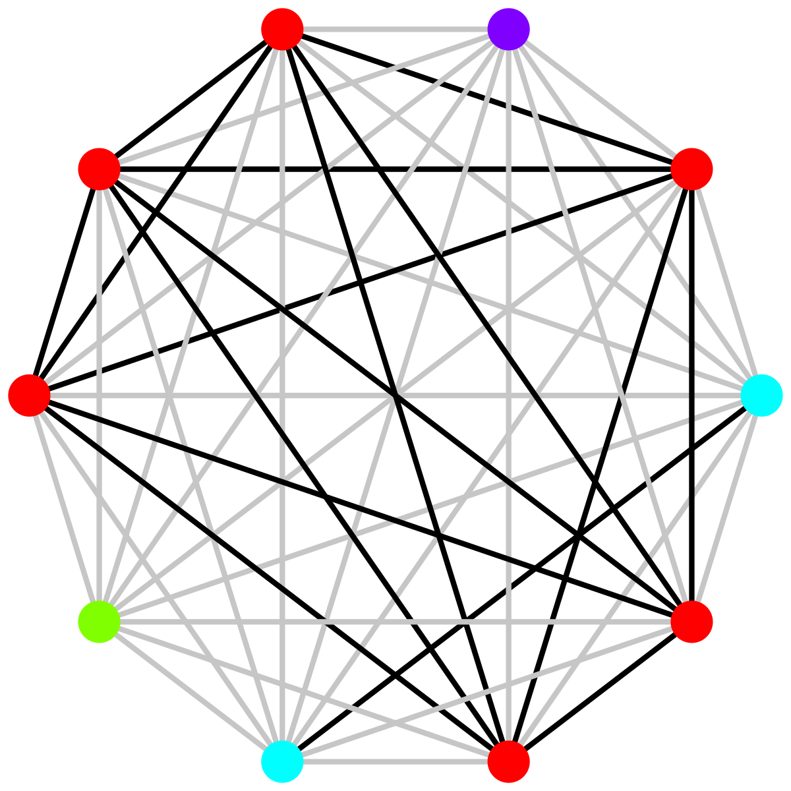{.pub-thumb-img fig-alt="Coethnics Covote in Africa"}
:::
::: {.pub-card-content}
::: {.pub-title}
Coethnics Covote in Africa: Studying Electoral Cleavages with a Co-Voting Regression Model
:::
::: {.pub-authors}
Carl Müller-Crepon & Nils-Christian Bormann
:::
::: {.pub-venue}
*American Political Science Review*, 2026
:::
::: {.pub-links}
[PDF](papers/Mueller-Crepon_Bormann-co-Ethnics_co-vote_in_Africa-March2026.pdf){.pub-link target="_blank"}
[DOI](https://doi.org/10.1017/S0003055426101579){.pub-link target="_blank"}
[Appendix](papers/Mueller-Crepon_Bormann-co-Ethnics_co-vote_in_Africa-March2026-Appendix.pdf){.pub-link target="_blank"}
[Replication Data](https://dataverse.harvard.edu/dataset.xhtml?persistentId=doi:10.7910/DVN/1F74D0){.pub-link target="_blank"}
[Working Paper](https://www.afrobarometer.org/publication/wp221-coethnics-covote-in-africa/){.pub-link target="_blank"}
:::
:::
:::

2025

::: {.pub-card .pub-card-with-img}
::: {.pub-card-thumb}
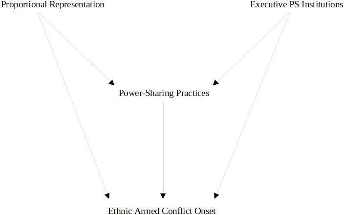{.pub-thumb-img fig-alt="Probing PR"}
:::
::: {.pub-card-content}
::: {.pub-title}
Probing PR: Does Proportional Representation Induce Ethnic Power Sharing and Reduce Conflict?
:::
::: {.pub-authors}
Nils-Christian Bormann & Simon Hug
:::
::: {.pub-venue}
*Research & Politics*, 12(4), 2025, pp. 1–7
:::
::: {.pub-links}
[PDF](https://journals.sagepub.com/doi/epub/10.1177/20531680251389184){.pub-link target="_blank"}
[DOI](https://doi.org/10.1177/20531680251389184){.pub-link target="_blank"}
[Replication Data](https://dataverse.harvard.edu/citation?persistentId=doi:10.7910/DVN/XFDOTX){.pub-link target="_blank"}
:::
:::
:::

::: {.pub-card .pub-card-with-img}
::: {.pub-card-thumb}
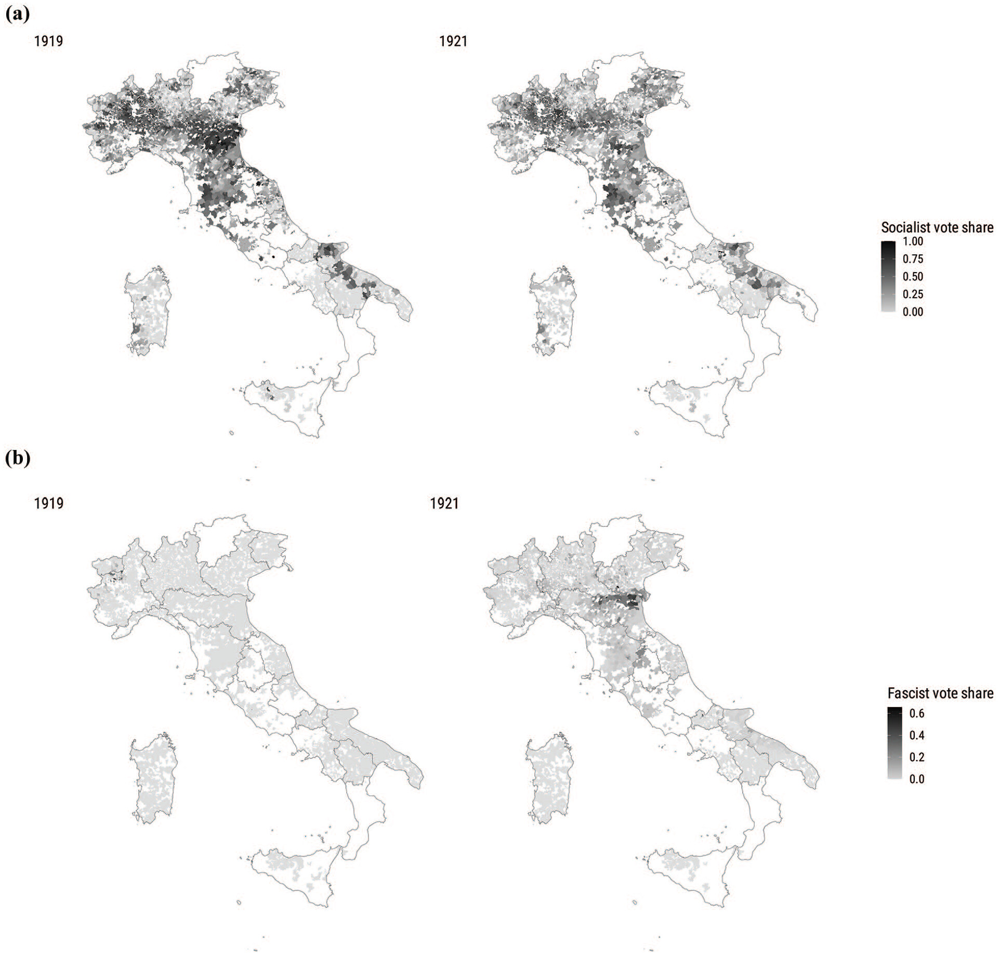{.pub-thumb-img fig-alt="Political Violence and Anti-System Voting"}
:::
::: {.pub-card-content}
::: {.pub-title}
Political Violence and Anti-System Voting in Interwar Italy
:::
::: {.pub-authors}
Edoardo Alberto Viganò, Bruno Della Sala, Stefan Stojkovic & Nils-Christian Bormann
:::
::: {.pub-venue}
*Journal of Peace Research*, 62(5), 2025, pp. 1581–1596
:::
::: {.pub-links}
[PDF](papers/ViganoEtAl-Political_Violence_and_Antisystem_Voting-JPR2025.pdf){.pub-link target="_blank"}
[DOI](https://doi.org/10.1177/00223433251347763){.pub-link target="_blank"}
[Replication Data](https://dataverse.harvard.edu/dataset.xhtml?persistentId=doi:10.7910/DVN/TZAGJD){.pub-link target="_blank"}
:::
:::
:::

::: {.pub-card .pub-card-with-img}
::: {.pub-card-thumb}
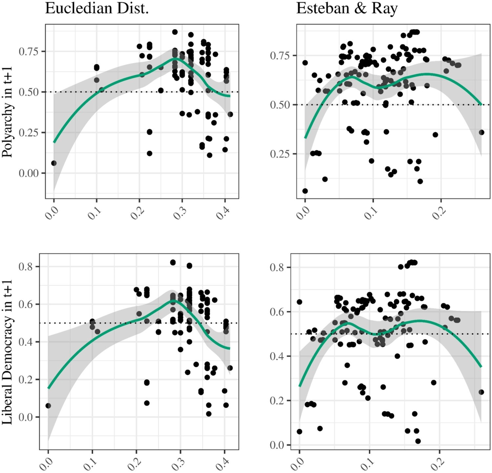{.pub-thumb-img fig-alt="Polarization, Fragmentation, and Democratic Deconsolidation"}
:::
::: {.pub-card-content}
::: {.pub-title}
Polarization, Fragmentation, and Democratic Deconsolidation in Interwar Europe
:::
::: {.pub-authors}
Lea Kaftan & Nils-Christian Bormann
:::
::: {.pub-venue}
*Democratization*, Online First, 2025, pp. 1–24
:::
::: {.pub-links}
[PDF](papers/Kaftan_Bormann-Polarization_Fragmentation_and_Deconsolidation.pdf){.pub-link target="_blank"}
[DOI](https://doi.org/10.1080/13510347.2025.2537218){.pub-link target="_blank"}
[Replication Data](https://osf.io/dr7vh/files/osfstorage){.pub-link target="_blank"}
:::
:::
:::

::: {.pub-card .pub-card-with-img}
::: {.pub-card-thumb}
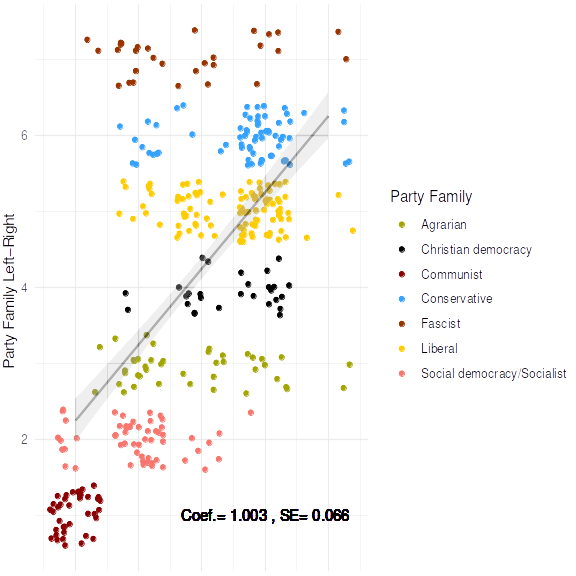{.pub-thumb-img fig-alt="AIEEDA"}
:::
::: {.pub-card-content}
::: {.pub-title}
Introducing the Archive of Interwar Europe Election Data & Assemblies (AIEEDA)
:::
::: {.pub-authors}
Lea Kaftan, Bruno Della Sala, Olga Jerjomina, Stefan Stojkovic, Edoardo Viganò & Nils-Christian Bormann
:::
::: {.pub-venue}
*Scientific Data*, 2025
:::
::: {.pub-links}
[PDF](https://rdcu.be/ehPVF){.pub-link target="_blank"}
[DOI](https://doi.org/10.1038/s41597-025-04969-y){.pub-link target="_blank"}
[Dataset](https://osf.io/qs3dg/files/osfstorage){.pub-link target="_blank"}
:::
:::
:::

::: {.pub-card .pub-card-with-img}
::: {.pub-card-thumb}
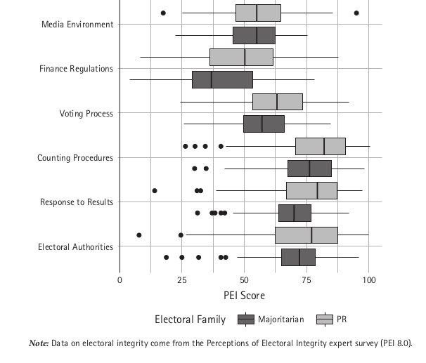{.pub-thumb-img fig-alt="Electoral Systems"}
:::
::: {.pub-card-content}
::: {.pub-title}
Electoral Systems
:::
::: {.pub-authors}
Matt Golder & Nils-Christian Bormann
:::
::: {.pub-venue}
*The Oxford Handbook of Electoral Integrity*, 2025
:::
::: {.pub-links}
[PDF](papers/GolderBormann-ElectoralSystems-2025.pdf){.pub-link target="_blank"}
[DOI](https://doi.org/10.1093/oxfordhb/9780197777497.013.0010){.pub-link target="_blank"}
:::
:::
:::

2024

::: {.pub-card .pub-card-with-img}
::: {.pub-card-thumb}
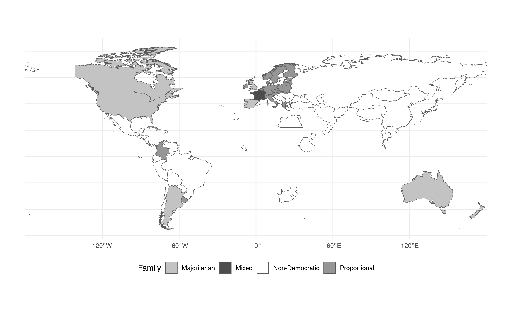{.pub-thumb-img fig-alt="DES Interwar"}
:::
::: {.pub-card-content}
::: {.pub-title}
Introducing the Democratic Electoral Systems Data, 1919–1945
:::
::: {.pub-authors}
Nils-Christian Bormann & Lea Kaftan
:::
::: {.pub-venue}
*Open Research Europe*, 2024
:::
::: {.pub-links}
[PDF](papers/DES_interwar_paper.pdf){.pub-link target="_blank"}
[DOI](https://doi.org/10.12688/openreseurope.17264.2){.pub-link target="_blank"}
[Dataset](https://doi.org/10.7910/DVN/FWLXHM){.pub-link target="_blank"}
:::
:::
:::

2022

::: {.pub-card .pub-card-with-img}
::: {.pub-card-thumb}
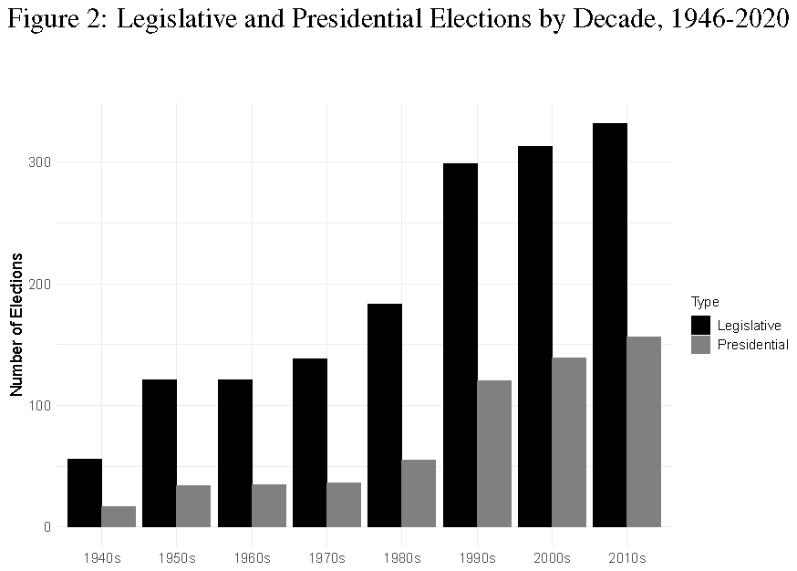{.pub-thumb-img fig-alt="Democratic Electoral Systems 1946-2020"}
:::
::: {.pub-card-content}
::: {.pub-title}
Democratic Electoral Systems, 1946–2020
:::
::: {.pub-authors}
Nils-Christian Bormann & Matt Golder
:::
::: {.pub-venue}
*Electoral Studies*, 2022
:::
::: {.pub-links}
[PDF](papers/Electoral_Systems_Paper.pdf){.pub-link target="_blank"}
[DOI](https://doi.org/10.1016/j.electstud.2022.102487){.pub-link target="_blank"}
[Dataset](https://mattgolder.com/elections){.pub-link target="_blank"}
:::
:::
:::

::: {.pub-card .pub-card-with-img}
::: {.pub-card-thumb}
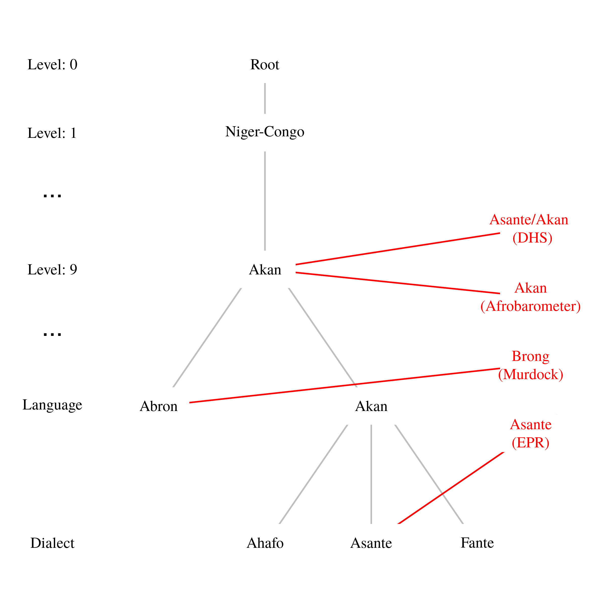{.pub-thumb-img fig-alt="LEDA"}
:::
::: {.pub-card-content}
::: {.pub-title}
Linking Ethnic Data from Africa (LEDA)
:::
::: {.pub-authors}
Carl Müller-Crepon, Yannick I. Pengl & Nils-Christian Bormann
:::
::: {.pub-venue}
*Journal of Peace Research*, 59(3), 2022, pp. 425–435
:::
::: {.pub-links}
[PDF](papers/leda_maintext.pdf){.pub-link target="_blank"}
[DOI](https://doi.org/10.1177/00223433211016528){.pub-link target="_blank"}
:::
:::
:::

2021

::: {.pub-card .pub-card-with-img}
::: {.pub-card-thumb}
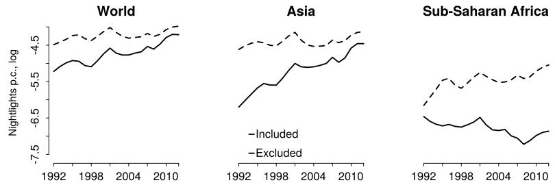{.pub-thumb-img fig-alt="Globalization, Institutions, and Ethnic Inequality"}
:::
::: {.pub-card-content}
::: {.pub-title}
Globalization, Institutions, and Ethnic Inequality
:::
::: {.pub-authors}
Nils-Christian Bormann, Yannick I. Pengl, Lars-Erik Cederman & Nils B. Weidmann
:::
::: {.pub-venue}
*International Organization*, 2021
:::
::: {.pub-links}
[PDF](papers/Ethnic_Inequality_Paper.pdf){.pub-link target="_blank"}
[DOI](https://doi.org/10.1017/S0020818321000096){.pub-link target="_blank"}
[Replication Data](https://doi.org/10.7910/DVN/QLG842){.pub-link target="_blank"}
:::
:::
:::

::: {.pub-card .pub-card-with-img}
::: {.pub-card-thumb}
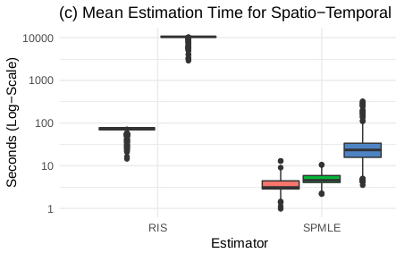{.pub-thumb-img fig-alt="Fast Estimator"}
:::
::: {.pub-card-content}
::: {.pub-title}
A Fast Estimator for Binary Choice Models with Spatial, Temporal, and Spatio-Temporal Interdependence
:::
::: {.pub-authors}
Julian Wucherpfennig, Aya Kachi, Nils-Christian Bormann & Philipp Hunziker
:::
::: {.pub-venue}
*Political Analysis*, 29(4), 2021, pp. 570–576
:::
::: {.pub-links}
[PDF](papers/Spatial_Logit_Paper.pdf){.pub-link target="_blank"}
[DOI](https://doi.org/10.1017/pan.2020.54){.pub-link target="_blank"}
[Replication Data](https://doi.org/10.7910/DVN/9SKYLD){.pub-link target="_blank"}
:::
:::
:::

2019

::: {.pub-card .pub-card-with-img}
::: {.pub-card-thumb}
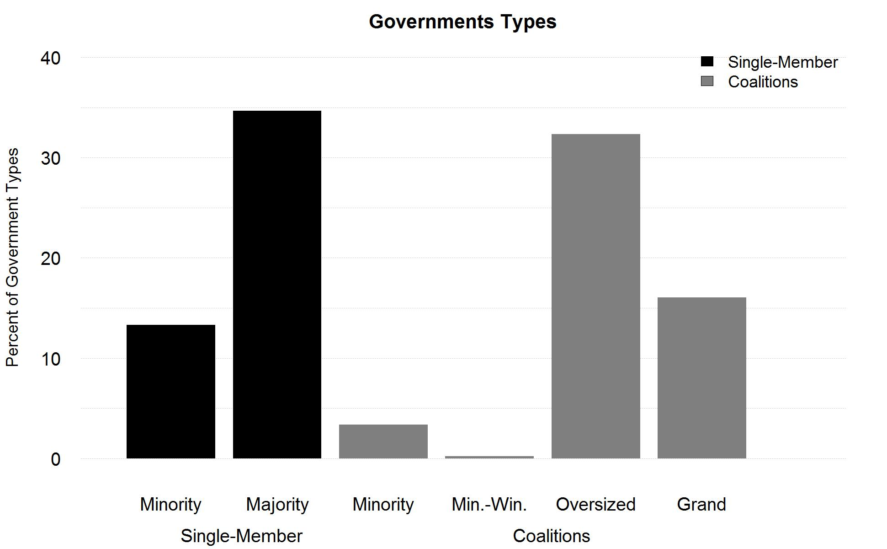{.pub-thumb-img fig-alt="Uncertainty, Cleavages, and Ethnic Coalitions"}
:::
::: {.pub-card-content}
::: {.pub-title}
Uncertainty, Cleavages, and Ethnic Coalitions
:::
::: {.pub-authors}
Nils-Christian Bormann
:::
::: {.pub-venue}
*Journal of Politics*, 81(2), 2019, pp. 471–486
:::
::: {.pub-links}
[PDF](papers/Uncertainty_Cleavages_Coalitions_main.pdf){.pub-link target="_blank"}
[DOI](https://doi.org/10.1086/701633){.pub-link target="_blank"}
[Replication Data](https://doi.org/10.7910/DVN/KGZGLT){.pub-link target="_blank"}
:::
:::
:::

::: {.pub-card .pub-card-with-img}
::: {.pub-card-thumb}
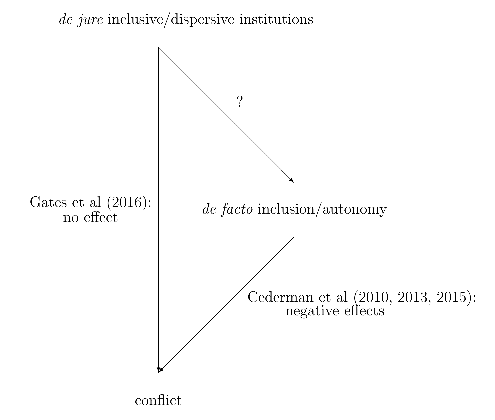{.pub-thumb-img fig-alt="Power Sharing"}
:::
::: {.pub-card-content}
::: {.pub-title}
Power Sharing: Institutions, Behavior, and Peace
:::
::: {.pub-authors}
Nils-Christian Bormann, Lars-Erik Cederman, Scott Gates, Benjamin A.T. Graham, Simon Hug, Kaare W. Strom & Julian Wucherpfennig
:::
::: {.pub-venue}
*American Journal of Political Science*, 63(1), 2019, pp. 84–100
:::
::: {.pub-links}
[PDF](papers/Institutions_Behavior_Peace_main.pdf){.pub-link target="_blank"}
[DOI](https://doi.org/10.1111/ajps.12407){.pub-link target="_blank"}
[Replication Data](https://doi.org/10.7910/DVN/3DK6JA){.pub-link target="_blank"}
:::
:::
:::

::: {.pub-card .pub-card-with-img}
::: {.pub-card-thumb}
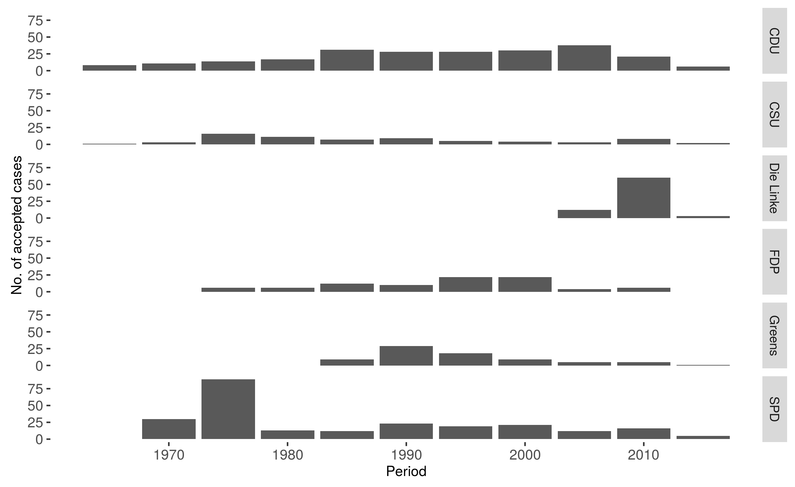{.pub-thumb-img fig-alt="Judicial Decision-Making within Political Parties"}
:::
::: {.pub-card-content}
::: {.pub-title}
Judicial Decision-Making within Political Parties: A Political Approach
:::
::: {.pub-authors}
Nicole Bolleyer, Felix-Christopher von Nostitz & Nils-Christian Bormann
:::
::: {.pub-venue}
*Party Politics*, 25(5), 2019, pp. 724–735
:::
::: {.pub-links}
[PDF](papers/BolleyerEtal-PartyTribunals-2019.pdf){.pub-link target="_blank"}
[DOI](https://doi.org/10.1177/1354068819836036){.pub-link target="_blank"}
[Appendix](papers/BolleyerEtal-PartyTribunals-2019-Appendix.pdf){.pub-link target="_blank"}
:::
:::
:::

2018

::: {.pub-card .pub-card-with-img}
::: {.pub-card-thumb}
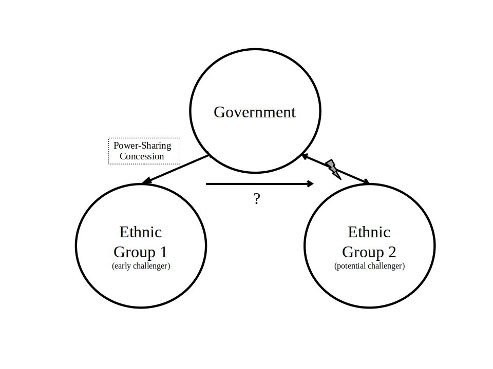{.pub-thumb-img fig-alt="Reputation, Concessions, and Territorial Civil War"}
:::
::: {.pub-card-content}
::: {.pub-title}
Reputation, Concessions, and Territorial Civil War
:::
::: {.pub-authors}
Nils-Christian Bormann & Burcu Savun
:::
::: {.pub-venue}
*Journal of Peace Research*, 55(5), 2018, pp. 671–686
:::
::: {.pub-links}
[PDF](papers/Reputation_Concessions_CivilWar-main.pdf){.pub-link target="_blank"}
[DOI](https://doi.org/10.1177/0022343318767499){.pub-link target="_blank"}
[Replication Data](https://www.prio.org/utility/DownloadFile.ashx?id=46&type=replicationfile){.pub-link target="_blank"}
:::
:::
:::

2017

::: {.pub-card .pub-card-with-img}
::: {.pub-card-thumb}
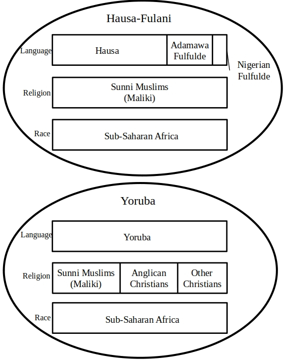{.pub-thumb-img fig-alt="Language, Religion, and Ethnic Civil War"}
:::
::: {.pub-card-content}
::: {.pub-title}
Language, Religion, and Ethnic Civil War
:::
::: {.pub-authors}
Nils-Christian Bormann, Lars-Erik Cederman & Manuel Vogt
:::
::: {.pub-venue}
*Journal of Conflict Resolution*, 61(4), 2017, pp. 744–771
:::
::: {.pub-links}
[PDF](papers/CleavageConflict-MainText.pdf){.pub-link target="_blank"}
[DOI](https://doi.org/10.1177/0022002715600755){.pub-link target="_blank"}
[Dataset](https://journals.sagepub.com/doi/suppl/10.1177/0022002715600755){.pub-link target="_blank"}
:::
:::
:::

2016

::: {.pub-card .pub-card-with-img}
::: {.pub-card-thumb}
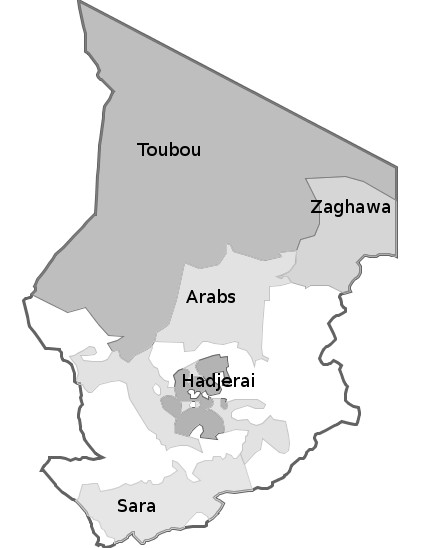{.pub-thumb-img fig-alt="A Slippery Slope"}
:::
::: {.pub-card-content}
::: {.pub-title}
A Slippery Slope: The Domestic Diffusion of Ethnic Civil War
:::
::: {.pub-authors}
Nils-Christian Bormann & Jesse Hammond
:::
::: {.pub-venue}
*International Studies Quarterly*, 60(4), 2016, pp. 587–598
:::
::: {.pub-links}
[PDF](papers/Slippery_Slope_Diffusion-main.pdf){.pub-link target="_blank"}
[DOI](https://doi.org/10.1093/isq/sqw031){.pub-link target="_blank"}
[Replication Data](https://doi.org/10.7910/DVN/GOCL05){.pub-link target="_blank"}
:::
:::
:::

::: {.pub-card .pub-card-with-img}
::: {.pub-card-thumb}
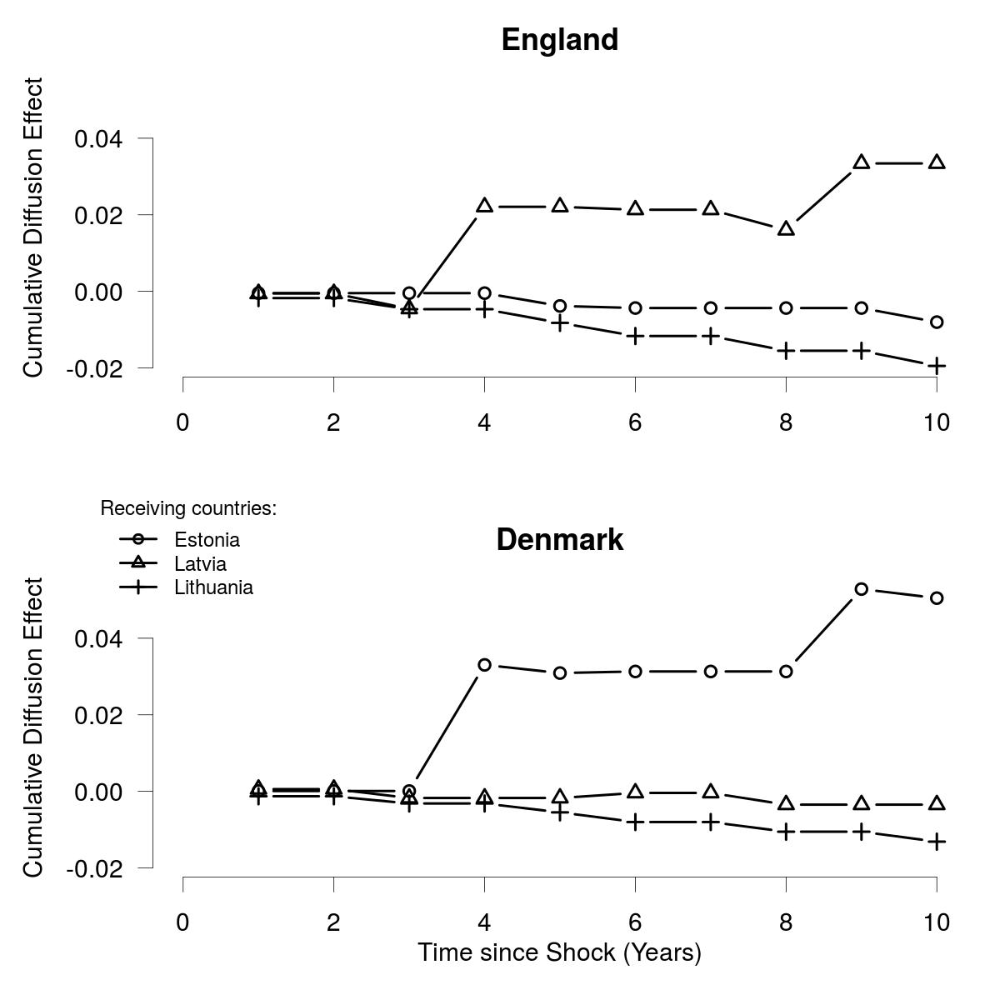{.pub-thumb-img fig-alt="Contingent Diffusion of Parliamentary Oversight"}
:::
::: {.pub-card-content}
::: {.pub-title}
The Contingent Diffusion of Parliamentary Oversight Institutions in the European Union
:::
::: {.pub-authors}
Nils-Christian Bormann & Thomas Winzen
:::
::: {.pub-venue}
*European Journal of Political Research*, 55(3), 2016, pp. 589–608
:::
::: {.pub-links}
[PDF](papers/Diffusion_Parliament_Institutions-main.pdf){.pub-link target="_blank"}
[DOI](https://doi.org/10.1111/1475-6765.12149){.pub-link target="_blank"}
[Replication Data](https://doi.org/10.7910/DVN/PQJQ0K){.pub-link target="_blank"}
:::
:::
:::

2015

::: {.pub-card .pub-card-with-img}
::: {.pub-card-thumb}
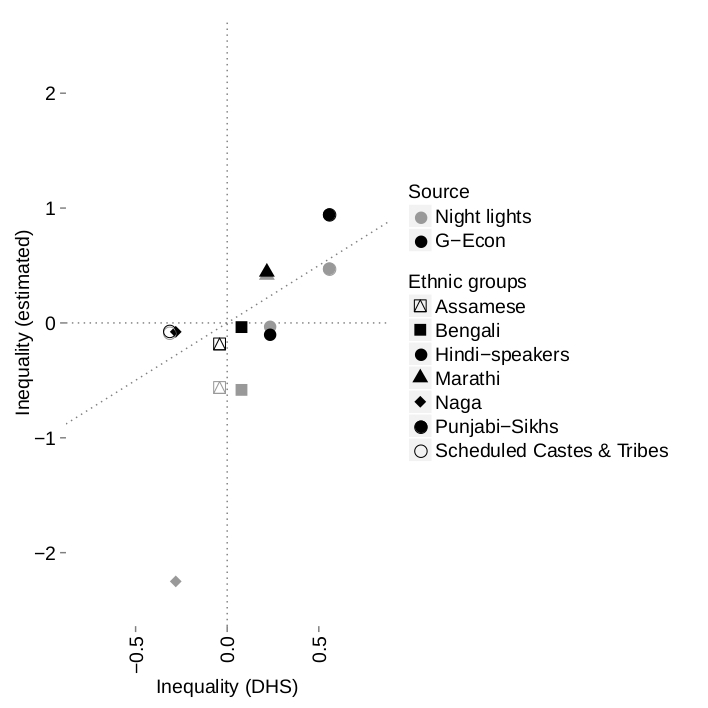{.pub-thumb-img fig-alt="Triangulating Horizontal Inequality"}
:::
::: {.pub-card-content}
::: {.pub-title}
Triangulating Horizontal Inequality: Toward Improved Conflict Analysis
:::
::: {.pub-authors}
Lars-Erik Cederman, Nils B. Weidmann & Nils-Christian Bormann
:::
::: {.pub-venue}
*Journal of Peace Research*, 52(6), 2015, pp. 806–821
:::
::: {.pub-links}
[PDF](papers/Cederman_et_al-Triangulating_Horizontal_Inequality_Towards_improved_Conflict_Analysis-2015.pdf){.pub-link target="_blank"}
[DOI](https://doi.org/10.1177/0022343315597969){.pub-link target="_blank"}
[Dataset](https://journals.sagepub.com/doi/suppl/10.1177/0022343315597969){.pub-link target="_blank"}
:::
:::
:::

::: {.pub-card .pub-card-with-img}
::: {.pub-card-thumb}
{.pub-thumb-img fig-alt="The Ethnic Power Relations Dataset"}
:::
::: {.pub-card-content}
::: {.pub-title}
The Ethnic Power Relations Dataset Family: Integrating Data on Ethnicity, Geography, and Conflict
:::
::: {.pub-authors}
Manuel Vogt, Nils-Christian Bormann, Seraina Rüegger, Lars-Erik Cederman, Philipp Hunziker & Luc Girardin
:::
::: {.pub-venue}
*Journal of Conflict Resolution*, 59(7), 2015, pp. 1327–1342
:::
::: {.pub-links}
[PDF](papers/vogtetal-2015-integrating_JCR_010315.pdf){.pub-link target="_blank"}
[DOI](https://doi.org/10.1177/0022002715591215){.pub-link target="_blank"}
:::
:::
:::

---

Projects

::: {.pub-card .pub-card-with-img}

::: {.pub-card-thumb}
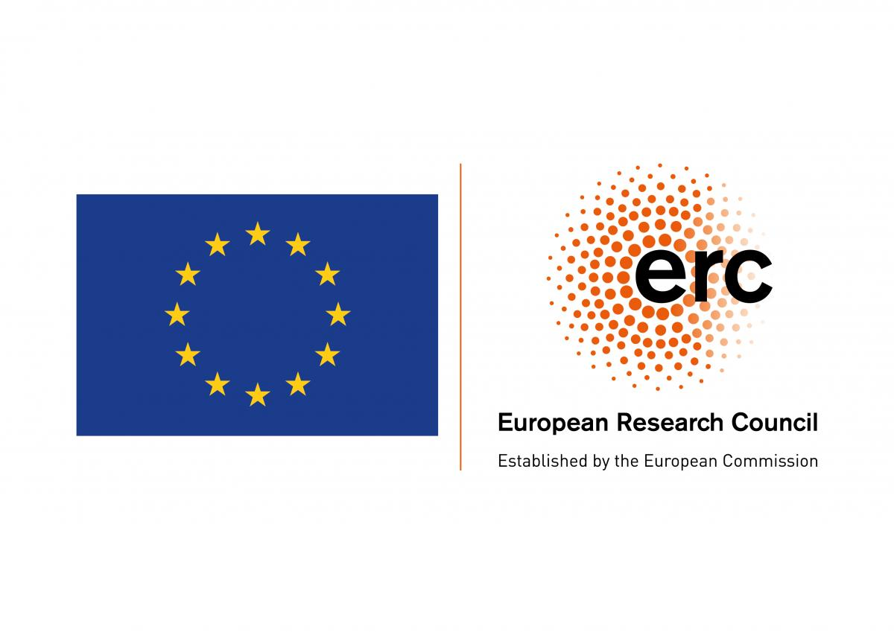{.pub-thumb-img fig-alt="European Research Council"}
:::

::: {.pub-card-content}
::: {.pub-title}
Democracy, Anger & Elite Responses (DANGER)
:::
::: {.pub-authors}
Funded by the European Research Council, 2021–2026
:::
::: {.pub-links}
[Project Site](https://www.erc-danger.de){.pub-link target="_blank"}
:::
:::

:::

::: {.pub-card .pub-card-with-img}

::: {.pub-card-thumb}
{.pub-thumb-img fig-alt="UK Research and Innovation"}
:::

::: {.pub-card-content}
::: {.pub-title}
Do Nightlights Emissions Enlighten?
:::
::: {.pub-authors}
Funded by UK Research and Innovation, 2016–2017
:::
::: {.pub-links}
[Project Site](https://gtr.ukri.org/projects?ref=AH%2FP008275%2F1){.pub-link target="_blank"}
:::
:::

:::

::: {.pub-card .pub-card-with-img}

::: {.pub-card-thumb}
{.pub-thumb-img fig-alt="Swiss National Science Foundation"}
:::

::: {.pub-card-content}
::: {.pub-title}
Power-sharing and Democracy: Beneficial and Perverse Effects
:::
::: {.pub-authors}
Funded by the Swiss National Science Foundation, 2012
:::
:::

:::

